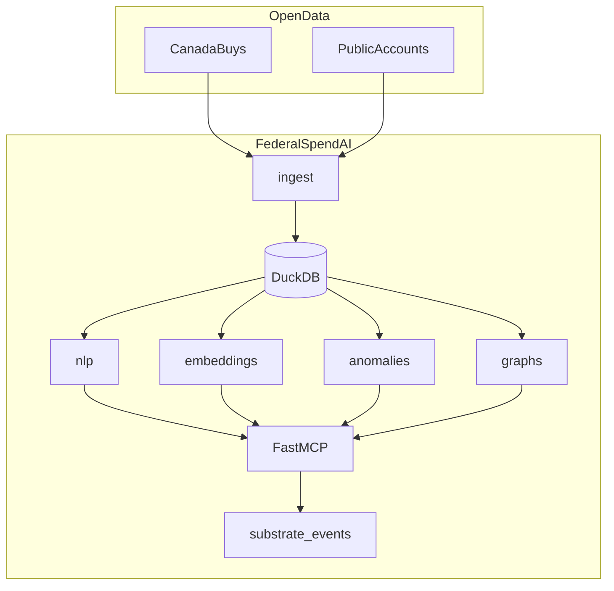

# federal-spend-ai

Open-source **Canadian federal spending analysis** with MCP tools, local DuckDB storage, NLP, semantic search, anomaly detection, and money-flow tracing over official open data.

> Not affiliated with or endorsed by the Government of Canada. Data is provided under the [Open Government Licence – Canada](https://open.canada.ca/en/open-government-licence-canada).

## Features

- **MCP server** — 20+ tools for contracts, Public Accounts, NLP, search, anomalies, and graphs
- **Data pipeline** — CanadaBuys awards + Public Accounts CSVs via CKAN, bilingual normalization, DuckDB
- **NLP** — spaCy / optional Blackstone NER, procurement risk flags, summaries
- **Semantic search** — sentence-transformers embeddings with hybrid keyword search
- **Anomaly detection** — department/vendor spend z-score outliers with investigation workflows
- **Money-flow graphs** — NetworkX vendor→department flows with Public Accounts linking
- **Cognitive Substrate hooks** — JSON event emission (`FlowGraphExported`, `AnomalyFlagged`, `EmbeddingIndexed`)

## Architecture



## Quickstart

```bash
pip install -e ".[dev]"
python -m spacy download en_core_web_sm

# Ingest sample fixtures
federalspendai ingest --datasets awards,public_accounts --fixture-dir tests/fixtures

# Build embedding index (downloads model on first run)
federalspendai embed

# Analyze, detect anomalies, trace money flow
federalspendai analyze --reference-number MX-444028039551
federalspendai detect-anomalies --json
federalspendai trace "Irving Oil Limited"

# MCP server
federalspendai serve
```

## MCP tools (summary)

| Category | Tools |
|----------|-------|
| Data | `search_contracts`, `contract_details`, `search_public_accounts`, aggregates |
| NLP | `extract_legal_entities`, `analyze_contract_text`, `batch_nlp` |
| Search | `semantic_search_contracts`, `hybrid_search`, `build_embeddings_index` |
| Analytics | `detect_anomalies`, `investigate_anomaly`, `correlate_effects` |
| Graphs | `build_money_flow_graph`, `trace_money_flow`, `export_graph` |

## Cognitive Substrate integration

Events are written to `~/.federalspendai/events/` and optionally POSTed to `FEDERALSPEND_SUBSTRATE_EVENT_URL`.

See [`examples/substrate_event_consumer.py`](examples/substrate_event_consumer.py).

## Data sources

| Dataset | CKAN ID |
|---------|---------|
| CanadaBuys awards | `a1acb126-9ce8-40a9-b889-5da2b1dd20cb` |
| Contract history | `4fe645a1-ffcd-40c1-9385-2c771be956a4` |
| Proactive Disclosure | `d8f85d91-7dec-4fd1-8055-483b77225d8b` |
| Public Accounts (Prof. Services) | `ac597ff8-ee13-48c3-b315-42e528090af2` |

## Container

The repo includes a `Dockerfile`, `docker-compose.yml`, and `setup.sh` for running the MCP server and CLI in Docker.

### VPS quick install (CyberPanel / bare Linux)

On a fresh VPS (Ubuntu, AlmaLinux, Rocky — with or without [CyberPanel](https://cyberpanel.net/)), run as **root**:

```bash
curl -fsSL https://raw.githubusercontent.com/SBPnet/federal-spend-ai/main/setup.sh -o setup.sh
chmod +x setup.sh
./setup.sh --with-swap
```

Or clone first and run locally:

```bash
git clone https://github.com/SBPnet/federal-spend-ai.git /opt/federalspendai
cd /opt/federalspendai
sudo ./setup.sh --with-swap
```

The script installs Docker (unless already present), builds the image, ingests sample fixtures, builds embeddings, and starts MCP on **`127.0.0.1:8000`** so OpenLiteSpeed / website ports **80/443** stay free. Connect from your machine via SSH tunnel:

```bash
ssh -L 8000:127.0.0.1:8000 root@YOUR_VPS_IP
```

Options: `./setup.sh --help` — use `--data live` for open.canada.ca ingest, `--skip-docker-install` if CyberPanel Docker is already configured.

### Build

```bash
docker build -t federalspendai .
```

### Run MCP server (SSE over HTTP)

```bash
docker run -d \
  --name federalspendai \
  -p 127.0.0.1:8000:8000 \
  -v federalspendai-data:/data \
  federalspendai
```

### One-time data setup with Compose

Load sample fixtures and build the embedding index into a named volume:

```bash
docker compose --profile init run --rm init
docker compose up -d federalspendai
```

### CLI examples

```bash
# Ingest sample fixtures (no network required)
docker run --rm \
  -v federalspendai-data:/data \
  -v "$(pwd)/tests/fixtures:/fixtures:ro" \
  federalspendai \
  federalspendai ingest --datasets awards,public_accounts --fixture-dir /fixtures

# Build embeddings (downloads model on first run)
docker run --rm \
  -v federalspendai-data:/data \
  federalspendai \
  federalspendai embed

# Check database status
docker run --rm \
  -v federalspendai-data:/data \
  federalspendai \
  federalspendai status
```

### MCP over stdio (Cursor / local MCP clients)

For clients that spawn the process and communicate over stdin/stdout:

```json
{
  "mcpServers": {
    "federal-spend-ai": {
      "command": "docker",
      "args": [
        "run", "-i", "--rm",
        "-v", "federalspendai-data:/data",
        "federalspendai",
        "federalspendai", "serve"
      ]
    }
  }
}
```

Pre-populate the `federalspendai-data` volume with ingest/embed before connecting.

### Environment variables

| Variable | Purpose |
|----------|---------|
| `FEDERALSPEND_DATA_DIR` | Root for DuckDB, cache, and events (default in image: `/data`) |
| `FEDERALSPEND_DB_PATH` | Override DuckDB file path |
| `FEDERALSPEND_SUBSTRATE_EVENT_URL` | Optional webhook for Cognitive Substrate events |

Mount a volume at `FEDERALSPEND_DATA_DIR` so data persists across container restarts. The first `embed` run downloads a sentence-transformers model; live `ingest` requires outbound HTTPS to `open.canada.ca`.

## Development

```bash
pip install -e ".[dev]"
pytest   # 29 tests
ruff check src tests
```

## License

MIT — see [LICENSE](LICENSE).
