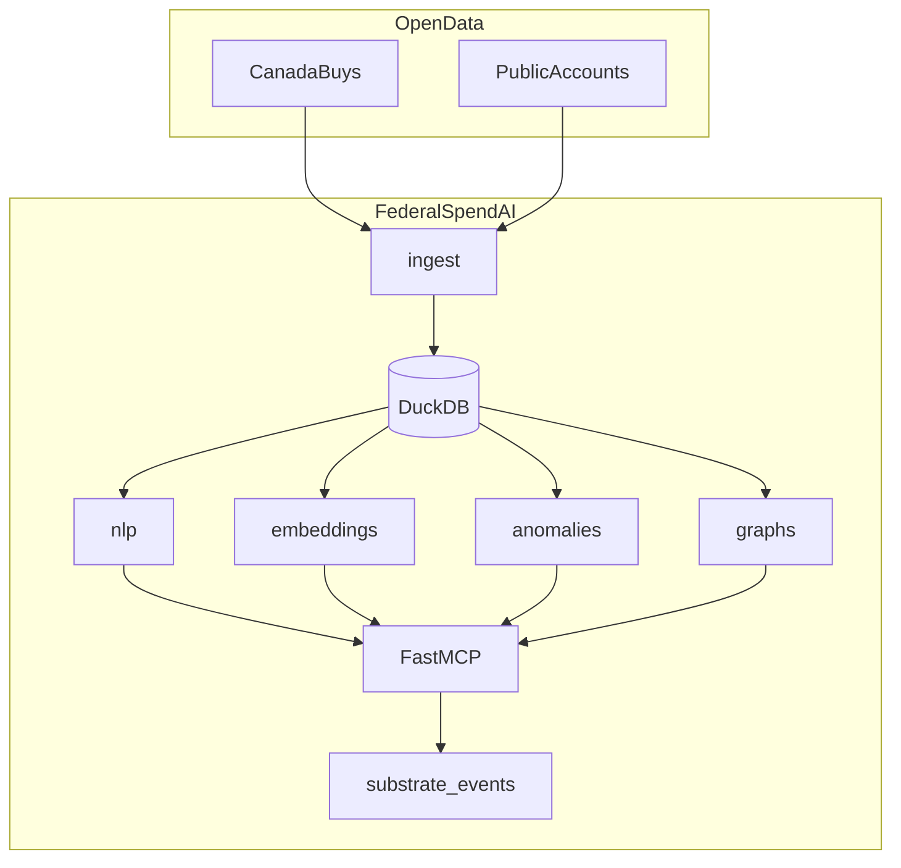

# federal-spend-ai

Open-source **Canadian federal spending analysis** with MCP tools, local DuckDB storage, NLP, semantic search, anomaly detection, and money-flow tracing over official open data.

> Not affiliated with or endorsed by the Government of Canada. Data is provided under the [Open Government Licence – Canada](https://open.canada.ca/en/open-government-licence-canada).

## Features

- **MCP server** — 20+ tools for contracts, Public Accounts, NLP, search, anomalies, and graphs
- **Data pipeline** — CanadaBuys awards + Public Accounts CSVs via CKAN, bilingual normalization, DuckDB
- **NLP** — spaCy / optional Blackstone NER, procurement risk flags, summaries
- **Semantic search** — sentence-transformers embeddings with hybrid keyword search
- **Anomaly detection** — department/vendor spend z-score outliers with investigation workflows
- **Money-flow graphs** — NetworkX vendor→department flows with Public Accounts linking
- **Cognitive Substrate hooks** — JSON event emission (`FlowGraphExported`, `AnomalyFlagged`, `EmbeddingIndexed`)

## Architecture



## Quickstart

```bash
pip install -e ".[dev]"
python -m spacy download en_core_web_sm

# Ingest sample fixtures
federalspendai ingest --datasets awards,public_accounts --fixture-dir tests/fixtures

# Build embedding index (downloads model on first run)
federalspendai embed

# Analyze, detect anomalies, trace money flow
federalspendai analyze --reference-number MX-444028039551
federalspendai detect-anomalies --json
federalspendai trace "Irving Oil Limited"

# MCP server
federalspendai serve
```

## MCP tools (summary)

| Category | Tools |
|----------|-------|
| Data | `search_contracts`, `contract_details`, `search_public_accounts`, aggregates |
| NLP | `extract_legal_entities`, `analyze_contract_text`, `batch_nlp` |
| Search | `semantic_search_contracts`, `hybrid_search`, `build_embeddings_index` |
| Analytics | `detect_anomalies`, `investigate_anomaly`, `correlate_effects` |
| Graphs | `build_money_flow_graph`, `trace_money_flow`, `export_graph` |

## Cognitive Substrate integration

Events are written to `~/.federalspendai/events/` and optionally POSTed to `FEDERALSPEND_SUBSTRATE_EVENT_URL`.

See [`examples/substrate_event_consumer.py`](examples/substrate_event_consumer.py).

## Data sources

| Dataset | CKAN ID |
|---------|---------|
| CanadaBuys awards | `a1acb126-9ce8-40a9-b889-5da2b1dd20cb` |
| Contract history | `4fe645a1-ffcd-40c1-9385-2c771be956a4` |
| Proactive Disclosure | `d8f85d91-7dec-4fd1-8055-483b77225d8b` |
| Public Accounts (Prof. Services) | `ac597ff8-ee13-48c3-b315-42e528090af2` |

## Development

```bash
pip install -e ".[dev]"
pytest   # 29 tests
ruff check src tests
```

## License

MIT — see [LICENSE](LICENSE).
