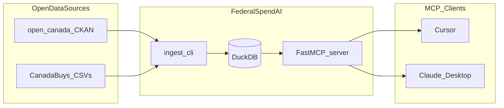

# federal-spend-ai

Open-source **Canadian federal spending analysis** with MCP tools, local DuckDB storage, and open government data from [CanadaBuys](https://canadabuys.canada.ca) and [open.canada.ca](https://open.canada.ca).

> Not affiliated with or endorsed by the Government of Canada. Data is provided under the [Open Government Licence – Canada](https://open.canada.ca/en/open-government-licence-canada).

## Features

- **MCP server** with 8 query tools for contracts, vendors, departments, and spending aggregates
- **NLP pipeline** — entity extraction (spaCy / optional Blackstone), risk flags, summaries
- **OSS data pipeline** — downloads official open CSVs via CKAN, normalizes bilingual columns, stores in DuckDB
- **Agent-friendly CLI** — `ingest`, `serve`, `status` with `--dry-run` and `--json`
- **Modular layout** — ready for NLP, embeddings, and anomaly detection extensions

## Architecture



## Quickstart

```bash
# Install (editable dev install)
pip install -e ".[dev]"

# Preview ingest plan
federalspendai ingest --dry-run --datasets awards

# Load sample fixtures (for development)
federalspendai ingest --datasets awards --fixture-dir tests/fixtures

# Or download official CanadaBuys CSVs (large)
federalspendai ingest --datasets awards

# Check local database status
federalspendai status --json

# NLP analysis on an ingested contract
federalspendai analyze --reference-number MX-444028039551

# Run MCP server (stdio)
federalspendai serve
```

### NLP setup (optional Blackstone)

```bash
python -m spacy download en_core_web_sm
pip install -e ".[nlp]"  # optional Blackstone package
# Blackstone model: pip install https://blackstone-model.s3-eu-west-1.amazonaws.com/en_blackstone_proto-0.0.1.tar.gz
```

## Cursor / Claude MCP configuration

See [`examples/cursor_mcp_config.json`](examples/cursor_mcp_config.json):

```json
{
  "mcpServers": {
    "federal-spend-ai": {
      "command": "federalspendai",
      "args": ["serve"]
    }
  }
}
```

**Prerequisite:** run `federalspendai ingest` at least once so the local DuckDB database has data.

## MCP tools

| Tool | Description |
|------|-------------|
| `federalspend_status_tool` | DB freshness, row counts, last ingest |
| `search_contracts_tool` | Search by vendor, department, keyword, dates, amounts |
| `contract_details_tool` | Full record by reference or contract number |
| `contract_count_tool` | Counts grouped by department, status, category, vendor |
| `top_vendors_tool` | Top suppliers by total contract value |
| `spending_by_department_tool` | Spending aggregated by contracting entity |
| `spending_by_category_tool` | Spending by UNSPSC / procurement category |
| `list_departments_tool` | Department list with contract counts |
| `extract_legal_entities_tool` | NER on contract text (spaCy or Blackstone) |
| `analyze_contract_text_tool` | Entities, risk flags, summary for text or ingested contract |
| `batch_nlp_tool` | Batch NLP over multiple reference numbers |

## Example agent prompts

- "What is the database status for federal spending data?"
- "Search contracts for vendor names containing 'IBM' over $1M."
- "Show top 10 vendors for Public Services and Procurement Canada."
- "How is spending distributed across departments?"
- "Get details for reference number MX-444028039551."

## Data sources

| Dataset | CKAN ID | Notes |
|---------|---------|-------|
| CanadaBuys award notices | `a1acb126-9ce8-40a9-b889-5da2b1dd20cb` | Primary contract awards |
| CanadaBuys contract history | `4fe645a1-ffcd-40c1-9385-2c771be956a4` | Amendments and lifecycle |
| Proactive Disclosure | `d8f85d91-7dec-4fd1-8055-483b77225d8b` | Consolidated contract reports |

## OSS stack

| Component | Library |
|-----------|---------|
| MCP | FastMCP |
| Storage | DuckDB + Polars |
| CLI | Click |
| Models | Pydantic |
| Future NLP | spaCy, sentence-transformers |
| Future analytics | scikit-learn, NetworkX |

## Development

```bash
pip install -e ".[dev]"
pytest
ruff check src tests
```

## License

MIT — see [LICENSE](LICENSE).
